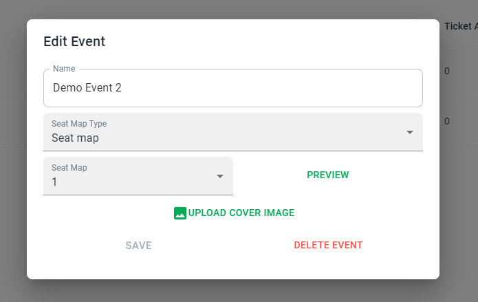
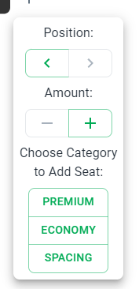

# Admin Dashboard
Tessera comes with a highly configurable admin dashboard, which is available at the
```/admin``` sub path of your ticket shop.


## Accessing the admin dashboard
When you visit ```/admin``` for the first time, you will be redirected to the login page.
If you have no registered user yet, you can register the first admin user by clicking the
```Register now``` button. After registering the default user, which will be granted with all permissions automatically,
you can now log in.

## Managing events
Select ```Event Management > Events``` in the sidebar. Here you can edit already existing events by clicking the 🖊️ button.

This opens a dialog where you can edit the event name and the seat type. You can choose between Seat map and free.
When choosing free you can select, which [categories](#categories) you want for this event.
While using seat map, you can select which seat map should be used for the event and directly preview the selected seat map.
To add a new event click the ```add event``` button. This will open a dialog where you can enter the event name and choose the
seat type. Additional configuration can be done afterwards in the edit dialog.

### Categories
You can manage your categories by selecting ```Event Management > Categories``` in the sidebar.
On this page you can add new categories (by clicking the ```add category``` button) or edit the existing ones (by clicking the 🖊️ button).
Categories define how much a ticket for this category cost, which currency should be used and which colors should be used in the seat map.
You either assign categories directly (when using ```free``` as seat type) or in the definition of the seat map.

> [!WARNING]
> Never edit category prices or currency for running events, as this has an influence on already booked but not yet paid orders.

### Seat Maps
To edit and add new seat maps, please select ```Event Maangement > Seat Maps``` in the sidebar.
Here you can view, which seat map is used in which event. Also, you can edit or add seat maps.
In the seat map editor, you can delete a seat by clicking on it. To add a new seat in row, click the ➕ button at the end of each row.



You see the new seat marked as black. You can change to position of the seat by clicking left or right and change the amount (e.g. for couple seats).
To finally add the seat, choose a category or ```Spacing``` (which is usefully for gangways).
To add a new row, click the ```add row``` button at the bottom of the seat map. Click the ```Save Seat Map``` when you are happy with your changes.
To increase editing speed you can export the current seat map to ```json``` format and upload it back to by clicking the import/export buttons.
You have also an overview on the colors used in the seat map when opening the ```Categories``` accordion.

## User Management
Of course, you can have multiple users, which can access individually configurable areas. To do so, open the ```User``` page on the left of the sidebar.
Here you can add new users by entering Username (unique), e-mail (unique) and password. After that, you can assign rights.

## Options
Open the ```Options``` page in the sidebar. Here you can edit information like title and subtitle of your ticket shop (general section),
set active payment or delivery methods and customize the shop theme by uploading a custom theme configuration.

> [!NOTE]
> Payment methods need to be configured using environment variables for security reasons.
